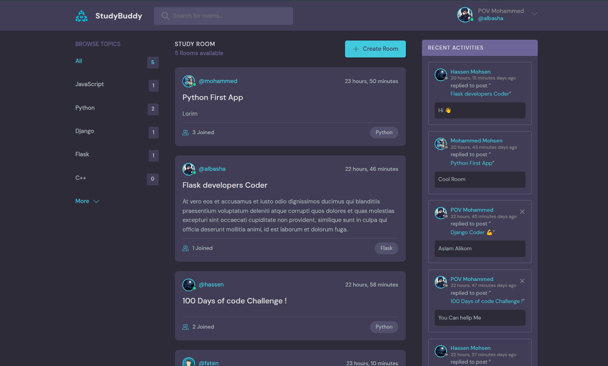
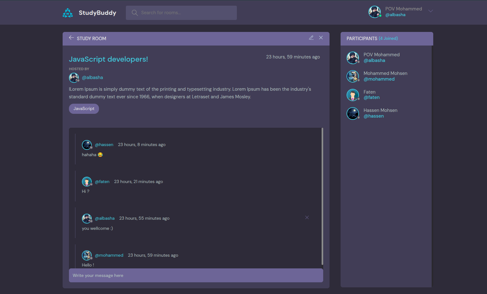
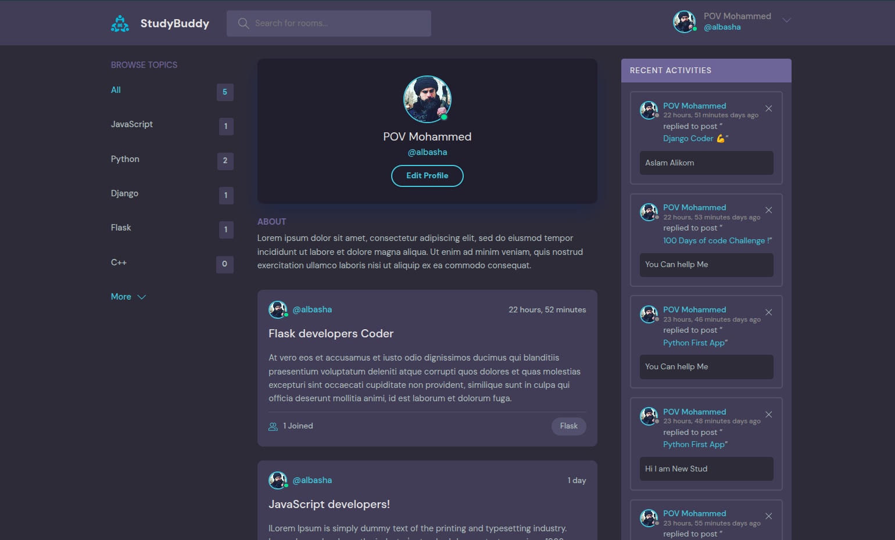
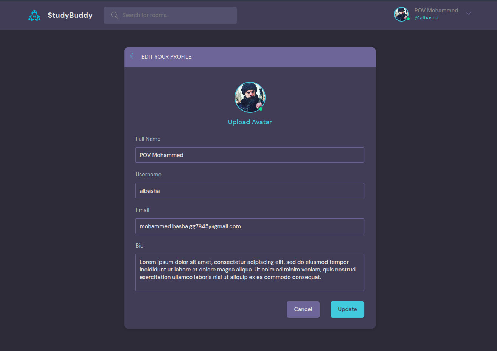
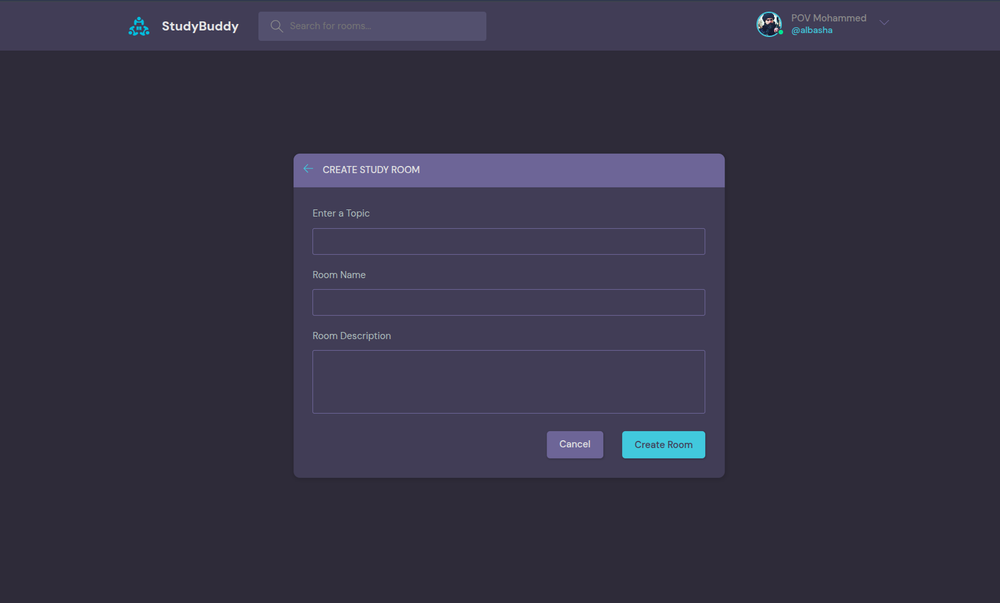
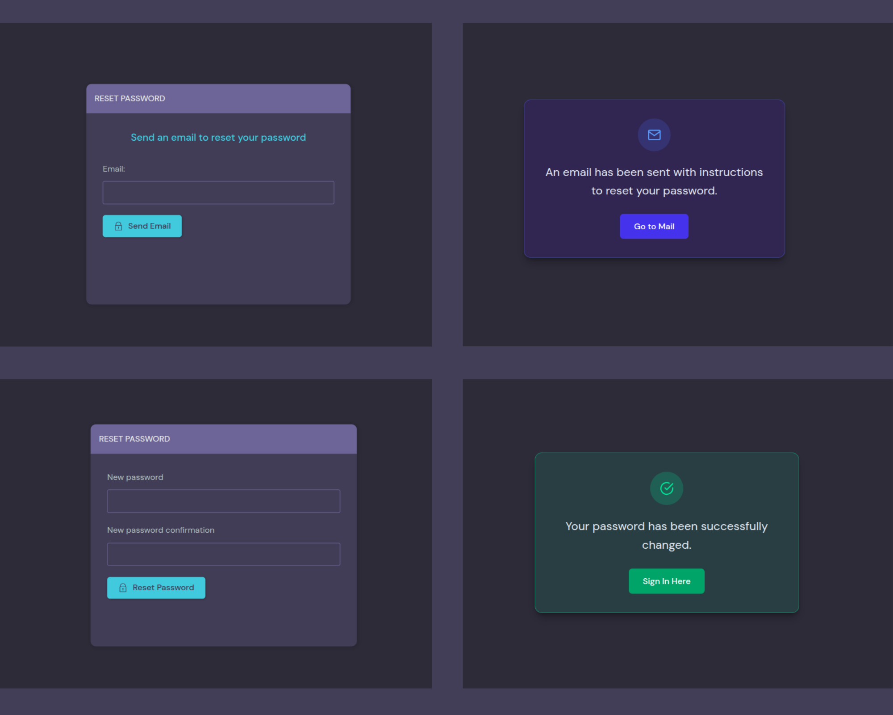

# Study-Room

A modern community-driven discussion platform built with Django, allowing users to create topic-based rooms, participate in conversations, exchange knowledge, and manage personalized profiles.

This project was developed as part of an in-depth journey into Django development, covering real-world concepts such as authentication, authorization, database relationships, custom user models, media uploads, password recovery, and introductory REST API development.

The goal was not only to build a functional application, but also to gain a solid understanding of how modern Django applications are structured and maintained.

---

# Application Preview

## Home Page



---

## Discussion Room



---

## User Profile



---

## Edit user information



---

## Create / Update Room




---

## Password Reset



---

# Core Features

## Authentication & Security

- User Registration
- User Login & Logout
- Email-Based Authentication
- Password Reset via Email
- Protected Views using Authentication Decorators
- Ownership-Based Authorization
- Password Validation
- Environment Variable Protection

---

## Custom User System

The project uses a custom Django User model extending `AbstractUser`, allowing future scalability and customization.

Features include:

- Custom User Model
- Unique Email Address
- User Biography
- User Avatar
- Custom Authentication Field
- Editable Profile Information

---

## User Profiles

Users can:

- Upload Profile Pictures
- Update Personal Information
- Edit Username
- Edit Email Address
- Add Personal Biography
- View Personal Activity

---

## Discussion Rooms

Users can:

- Create Rooms
- Update Rooms
- Delete Rooms
- Organize Rooms by Topics
- Search Rooms
- View Room Participants
- Join Discussions

Each room contains:

- Host User
- Topic
- Participants
- Messages
- Creation Timestamp
- Last Update Timestamp

---

## Messaging System

The application includes a complete room-based messaging system.

Features:

- Post Messages
- Delete Own Messages
- Room Conversations
- Recent Activity Feed
- Human-Friendly Time Display

---

## Participants System

The platform tracks room participation through a Many-to-Many relationship between users and rooms.

Features:

- Automatic Participant Registration
- Participant Listing
- Room Membership Tracking

---

## Search System

Users can search rooms by:

- Topic Name
- Room Name
- Host Username
- Room Description

The search functionality is powered by Django ORM and Q Objects.

---

# Database Design

The project demonstrates practical usage of relational database design through Django ORM.

### One-to-Many Relationships

```text
User  → Room
Topic → Room
User  → Message
Room  → Message
```

Implemented using:

```python
models.ForeignKey()
```

---

### Many-to-Many Relationships

```text
User ↔ Room (Participants)
```

Implemented using:

```python
models.ManyToManyField()
```

---

## REST API (Introduction)

This project includes the first steps toward REST API development using Django REST Framework.

Implemented endpoints:

```text
GET /api/
GET /api/rooms/
GET /api/rooms/<id>/
```

Implemented concepts:

- Django REST Framework
- Function-Based API Views
- Serializers
- JSON Responses
- API Routing

This serves as the foundation for future API expansion across the entire application.

---

# Media Handling

The application supports user-uploaded media using Django's media system.

Features:

- Avatar Uploads
- Default Profile Images
- Dynamic Media Serving
- Media Storage Configuration

---

# Technologies Used

- Python 3
- Django 6.0.5
- Django REST Framework
- SQLite
- HTML5
- CSS3
- JavaScript
- Pillow
- SMTP Email Services
- Python Dotenv

---

# What I Learned

Throughout this project I gained hands-on experience with:

- Django Models
- Django ORM
- QuerySets
- Authentication & Authorization
- Custom User Models
- ModelForms
- Form Validation
- Database Relationships
- Media Uploads
- Password Recovery Systems
- REST APIs
- URL Routing
- Function-Based Views
- Project Structure Organization

---

# Installation

## 1. Clone the Repository

```bash
git clone https://github.com/YOUR_USERNAME/Study-Room.git

cd Study-Room
```

---

## 2. Create a Virtual Environment

### Linux / macOS

```bash
python -m venv .venv

source .venv/bin/activate
```

### Windows

```bash
python -m venv .venv

.venv\Scripts\activate
```

---

## 3. Install Dependencies

```bash
pip install -r requirements.txt
```

---

# Environment Variables

Create a file named:

```text
.env
```

Add the following values:

```env
SECRET_KEY=your_secret_key

EMAIL_USER=your_email

EMAIL_PASS=your_email_password
```

---

# Database Setup

Apply migrations:

```bash
python manage.py migrate
```

---

# Create Admin User

```bash
python manage.py createsuperuser
```

---

# Run the Development Server

```bash
python manage.py runserver
```

Open:

```text
http://127.0.0.1:8000/
```

---

# Project Structure

```text
Study-Room/
│
├── base/
│   ├── api/
│   ├── migrations/
│   ├── templates/
│   ├── models.py
│   ├── forms.py
│   ├── views.py
│   └── urls.py
│
├── static/
├── templates/
├── StudyRooms/
│   ├── settings.py
│   ├── urls.py
│   └── wsgi.py
│
├── db.sqlite3
├── manage.py
├── .env
└── requirements.txt
```

---

# Future Improvements

Planned future enhancements include:

- Complete REST API Coverage
- JWT Authentication
- Room Join / Leave Workflow
- Notification System
- Direct Messaging
- Real-Time Chat using WebSockets
- Docker Support
- Production Deployment
- Automated Testing

---

# Author

**Mohammed Albasha**

This project represents a practical exploration of Django development, focusing on building real-world applications while understanding the framework from the ground up.

---

# License

This project is open-source and intended for educational and learning purposes.